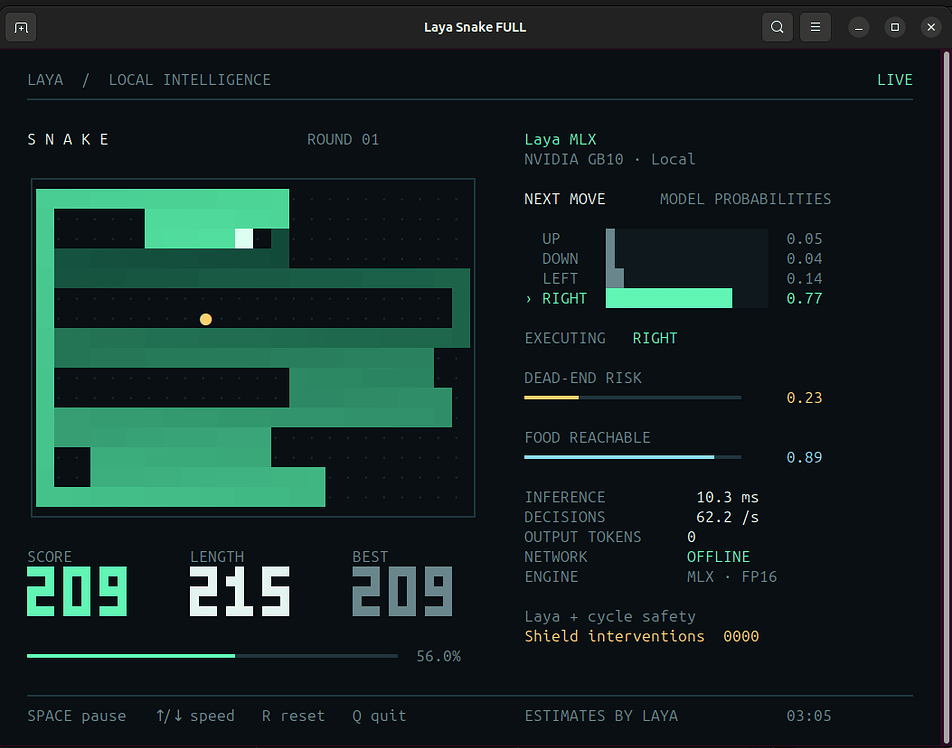

# Laya Snake on DGX Spark (GB10)

Run the Laya Snake demo (ported from the Apple-only laya-mlx to the PyTorch version) on an
NVIDIA DGX Spark GB10. **Verified on this box**: CUDA inference OK, snake runs at full speed,
GATE PASSED.

This box has no sudo, so everything runs on a **native Python venv** (no Docker).

> Traditional Chinese guide: [README.zh-Hant.md](README.zh-Hant.md) and [USER_GUIDE.html](USER_GUIDE.html).

---

## License & Attribution

This project is licensed under the **Apache License 2.0** (see [LICENSE](LICENSE),
[NOTICE](NOTICE)). It is a derivative work of:

- **laya-mlx** — https://github.com/mizorewww/laya-mlx (Apache-2.0); the Snake game and
  demo framework are adapted from it
- **Laya** — https://github.com/NandhaKishorM/laya (Apache-2.0); the model runtime /
  DecisionModel are adapted from it

Model weights are downloaded separately from Convai Innovations on Hugging Face
(`convaiinnovations/laya`, `convaiinnovations/laya-multilingual`) and are **not
included** in this repository.

---

## Live view (322M · full speed)



> Screenshot of **Laya Snake FULL** running at full speed on NVIDIA GB10 (322M model).
> The right panel shows decision probabilities, dead-end risk, food reachability, inference
> time and decisions per second.

---

## 1. Files

| Path | Purpose |
|---|---|
| `~/laya-snake-dgx/bootstrap.sh` | **One-shot install/repair** (fresh box or reinstall; idempotent, safe to re-run) |
| `~/laya-snake-dgx/after_reboot.sh` | **Resume after reboot** (verify + open window; no reinstall) |
| `~/laya-snake-dgx/run_snake.sh` | Launcher (exports the critical env) |
| `~/laya-snake-dgx/gate_check.py` | CUDA gate test (self-contained, offline) |
| `~/laya-snake-dgx/snake/` | The ported snake package |
| `~/laya-snake-dgx/USER_GUIDE.html` | Bilingual (ZH/EN) guide (open in browser) |
| `~/laya-snake-dgx/performance_card.html` | Performance comparison card (open in browser) |
| `~/laya-snake-dgx-work/venv/` | Python venv (on disk; survives reboot) |
| `~/laya-snake-dgx-work/hf/` | Model weight cache (on disk; survives reboot) |

**Package**: `laya-snake-dgx.zip` contains all of the above. `scp` it to the Spark and unzip.

---

## 2. Install from the zip (fresh box, all-in-one)

Four steps from the zip to a running snake.

### Step 1 + 2 · Transfer + unzip
```bash
# workstation
scp laya-snake-dgx.zip asus@<SPARK_IP>:~/

# Spark
cd ~
unzip -o laya-snake-dgx.zip      # creates ~/laya-snake-dgx/
ls ~/laya-snake-dgx/
```

### Step 3 · One-shot install (core)
```bash
bash ~/laya-snake-dgx/bootstrap.sh
```
Automatically: **check prereqs -> create venv -> install torch 2.14 cu130 (~4GB) -> laya runtime
-> snake package -> download weights -> build launcher -> run the CUDA gate**.
First run downloads a lot, 10-30 min. **You must see "GATE PASSED"** to be done.
Only verify, no reinstall: `bash ~/laya-snake-dgx/bootstrap.sh --gate`.

### Step 4 · Activate the venv + run
```bash
source ~/laya-snake-dgx-work/venv/bin/activate
python --version          # should show the venv's Python 3.12
laya-snake --max-speed    # or use the launcher (no manual activate)
```

---

## 3. About the venv

- Location: `~/laya-snake-dgx-work/venv`
- **Always activate before using python**: `source ~/laya-snake-dgx-work/venv/bin/activate`
- Verify: `which python` should point into the venv; `torch.cuda.is_available()` should be True
- Easy way: just run `run_snake.sh` / `gate_check.py` - they resolve the venv for you

---

## 4. After a reboot (most common)

The venv and weights live on disk, so **a reboot does not wipe them**; just resume, no reinstall,
no bootstrap.

```bash
bash ~/laya-snake-dgx/after_reboot.sh            # verify + open FULL interactive
bash ~/laya-snake-dgx/after_reboot.sh --headless # headless benchmark
```
It checks venv/torch/laya/weights -> confirms the :0 desktop -> opens a "Laya Snake FULL" window,
**and prints how to enter the venv**.

> Prereq: the GNOME desktop (`:0`) must be logged in. If it isn't ready right after boot, log in
> then re-run.

---

## 5. Ways to run the snake

```bash
~/laya-snake-dgx/run_snake.sh                          # interactive, 12 FPS
~/laya-snake-dgx/run_snake.sh --max-speed              # interactive, full speed (~75 steps/s)
~/laya-snake-dgx/run_snake.sh --headless --steps 600 --max-speed   # headless benchmark
~/laya-snake-dgx/run_snake.sh --max-speed --model convaiinnovations/laya   # switch to English 421M
~/laya-snake-dgx/run_snake.sh benchmark --rates 30 --sweep-steps 100 --seeds 101,102 --output ~/laya-snake-dgx-work/bench.json
```

### Interactive keys
| Key | Action |
|---|---|
| Space | Pause / resume |
| Up/Down or +/- | Adjust decision rate (+/-2) |
| R | New round with next seed |
| Q / Ctrl-C | Quit and restore the terminal |

---

## 6. Two gotchas (or it breaks)

1. **`TORCH_DISABLE_NATIVE_JIT=1` is required** - torch 2.14 compiles a Triton kernel on first
   inference and needs `Python.h` (python3-dev), which needs sudo you don't have. Both
   `run_snake.sh` and `gate_check.py` set it; **never bypass the launcher and call `laya-snake`
   directly**, or you hit the Triton error.
2. **Use the PyTorch weights** - `convaiinnovations/laya-multilingual` or `convaiinnovations/laya`,
   not MLX's `aac6fef/...-mlx`.

---

## 7. FAQ

| Issue | Cause | Fix |
|---|---|---|
| Triton `Python.h` error | missing `TORCH_DISABLE_NATIVE_JIT` | use `run_snake.sh`, not `laya-snake` |
| Low GPU util (8-16%) | 12 FPS pacing | normal; `--max-speed` -> ~74% |
| `torch.cuda.is_available()` False | NVIDIA driver issue | check driver / Container Toolkit |
| Weights missing | wrong cache path | re-run `bootstrap.sh` |
| Window not opening | desktop / dbus not ready | log in then re-run `after_reboot.sh` |
| `python` finds no packages | not in venv | `source ~/laya-snake-dgx-work/venv/bin/activate` |

---

## 8. Performance summary (GB10, clean room)

| Metric | GB10 421M | GB10 322M |
|---|---|---|
| Single-question P50 latency | 15.8 ms | 7.2 ms |
| 50-question throughput | 641 q/s | 1300 q/s |
| Snake full-speed steps/s | 48.4 | 107.6 |
| Snake mean inference | 20.4 ms | 9.1 ms |

Full comparison incl. Apple M3 Max: see `performance_card.html`.
